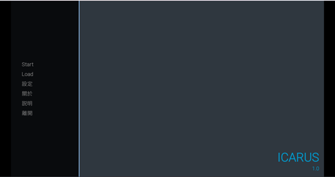
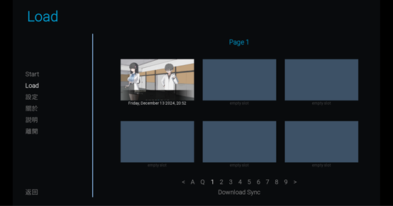
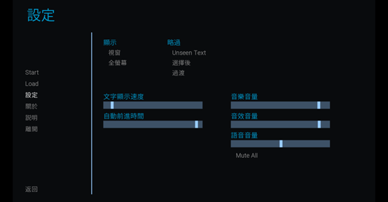
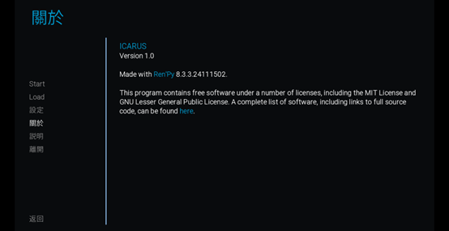
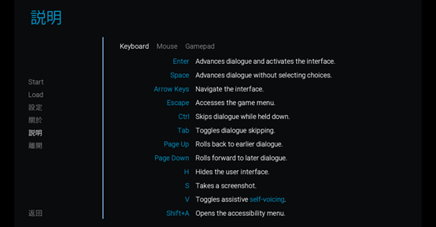
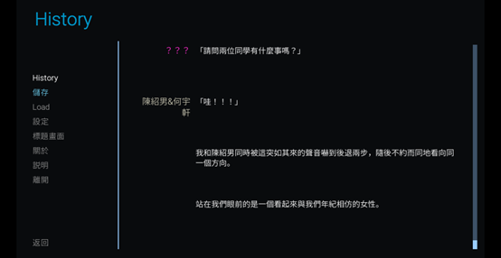

# 視覺小說遊戲：ICARUS

## 一、遊戲主畫面

- **Start**：開始進入遊戲
- **Load**：讀取存檔  
  遊戲過程中如想退出，可以按下存檔並存於這個介面中。
  

- **設定**：打開設定選單  
  可以調整遊戲各類參數。
  

- **關於**：版本號以及製作人員名單

- **說明**：遊戲操作說明  
  向玩家說明基礎遊玩的按鍵操作。
  

- **離開**：關閉遊戲

---

## 二、開始遊戲

### 遊戲方式
玩家只需按滑鼠左鍵或者鍵盤上的 `Space` 鍵就可以讓故事進行。

以下是遊玩畫面：  

在遊玩畫面中可以看見最下面一排選項：
- **返回**：返回上一句對話
- **History**：查看歷史的對話紀錄，如忘記之前的某些對話可以點選這個選項進行回顧。

- **略過**：略過當前情節。
- **自動**：遊戲自動進行，速度可在設定中的「自動前進時間」調整。
- **儲存**：存下目前進度，重新進入遊戲後可於 Load 介面找到。
- **Q.儲存** 與 **Q.讀取**：  
  快速儲存與快速讀取，快速儲存的檔案不會放在 Load 的存檔區中，且會被覆蓋。換句話說，快速存檔就像書籤功能，最新的快速存檔會覆蓋舊的。
- **設定**：與遊戲主畫面的設定功能相同，可打開設定選單，或進入 Load 介面。

---

劇本結束後會自動跳回主畫面，完成遊戲的流程。
